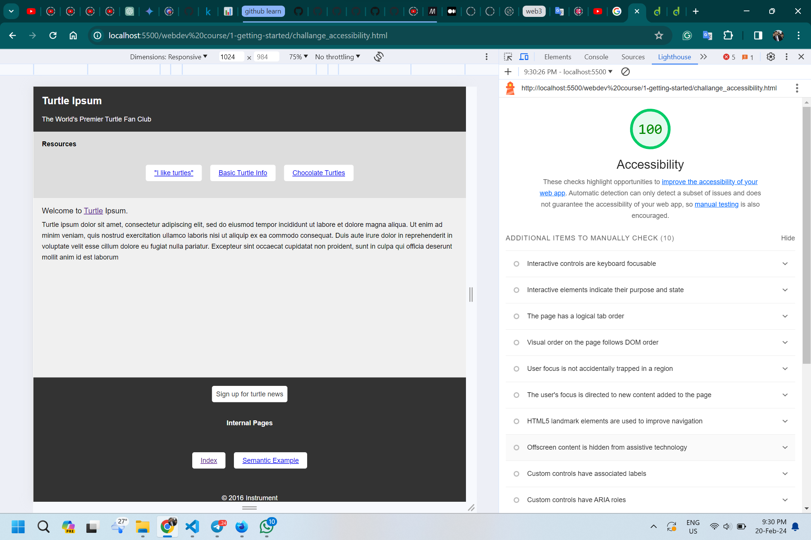

This is the first section of hte course. it has three sections:
1. intro to programming languages
2. github basics
3. accessibility

## Intro to programming languages
This section will cover the basics of programming languages. neccessary tools and development environtment. I relly liked the recources they provided. the MDN documentation is really helpful and it is a great place to start.
here is a link to the [MDN documentation](https://developer.mozilla.org/en-US/docs/Learn/Getting_started_with_the_web)

## Github basics
This section will cover the basics of github. how to create a repository, how to clone it, how to push and pull changes.
I really liked the part where they explained abotu branches and pull requests. it is a great way to collaborate with others. Also, they explained how to contribute to open source projects, and provided necessary links to get started.  

Here is a link for [How to Contribute to Open Source](https://opensource.guide/how-to-contribute/#how-to-submit-a-contribution)
Here is another useful link on how to [get started](https://github.blog/2020-01-22-browse-good-first-issues-to-start-contributing-to-open-source/)

## Accessibility
This section cover the basics of accesibility. it explains about **screen reders**. it explain about **contrast checker** that helps people with color blindness. And the importnace of good HTML principles, like using headers hirearchy, using alt text for images, and using semantic HTML. Using ARIA roles and attributes to make the website more accessible. Also, using correct HTLM tags, nad importnace of link texts (instead of saying "click here" use a descriptive text).

Here is a link to the [W3C documentation](https://www.w3.org/WAI/standards-guidelines/)

## Challenge
there was a challaneg for accesibility, where there is an html code is given, i have to make it more accessbile.

i have changed the [code](challange_accessibility.html), adn made it more accessible. I have tested it using lighthouse and it is 100% accessible now.

